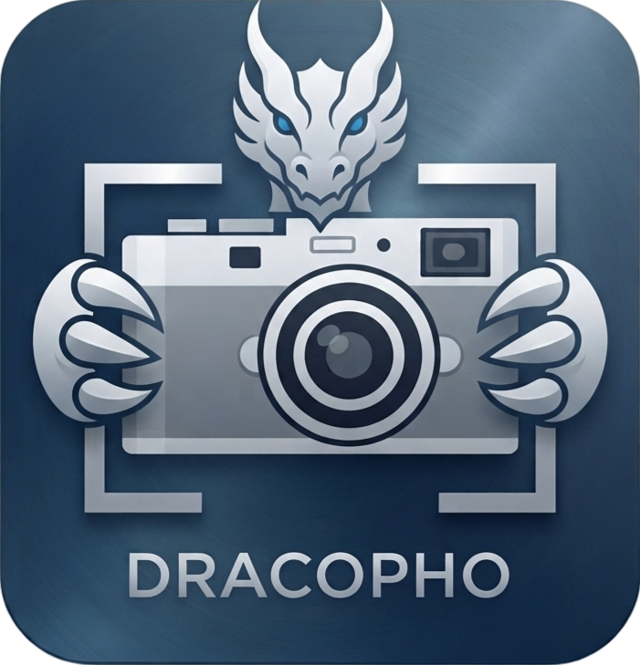

<div align="center">
  
  <h1>DracoPho</h1>
  <p>
    <a href="https://github.com/tystudio-26020701/DracoPho-community/releases">
      
    </a>
    
    
    
    
    
  </p>
</div>

[English README](../README.md)

اقرأ هذا الملف بلغات أخرى：
[简体中文](../README.zh-CN.md) · [繁體中文](./README.zh-TW.md) ·
[日本語](./README.ja.md) · [한국어](./README.ko.md) ·
[Русский](./README.ru.md) · [Italiano](./README.it.md) ·
[العربية](./README.ar.md) · [Français](./README.fr.md) ·
[Deutsch](./README.de.md) · [Español](./README.es.md) ·
[Português](./README.pt.md)

**الوسوم**：`C++` / `Qt 6` / `屏幕截图` / `图像标注` / `桌面贴图` / `OCR 识别` / `滚动长截图` / `Wayland` / `Windows`


<details>
<summary>فيديو العرض</summary>
<p align="center">
  <video src="https://github.com/user-attachments/assets/4f86fcee-fef9-409e-98ba-1491ecee06c7" width="100%" controls></video>
</p>
</details>

DracoPho هي أداة عالية الأداء لالتقاط لقطات الشاشة وتحريرها، مبنية على Qt 6. صُمم المشروع في البداية لمديري نوافذ Wayland مثل `niri`، ويدعم حالياً إنجاز سير عمل التقاط الشاشة والتحرير المعتاد على لينكس (X11 وGNOME وwlroots/Wayland) وكذلك في بيئة Windows.

تستطيع التقاط محتوى الشاشة في لحظة، وفتح طبقة تحرير متكيفة بملء الشاشة، لتوفر للمستخدم قصّ المنطقة وتحريرها ونسخها إلى الحافظة وحفظها وتثبيتها على سطح المكتب وغيرها من الوظائف.

---

## الميزات الأساسية

### صندوق أدوات التحرير
- **القلم وقلم التمييز**: يدعمان رسم خطوط حرة ناعمة وتغطية شفافة للتظليل.
- **أدوات الأشكال المتجهية**: خطوط ومستطيلات وأشكال بيضاوية عالية الدقة. يدعم المستطيل التبديل بين ثلاثة أنماط:
  - `描边`: المستطيل المخطط أو المعبأ، مع خيار الزوايا الدائرية.
  - `高亮`: تأثير تغطية بأسلوب قلم التمييز يُنفَّذ عبر `CompositionMode_Multiply` مع تعبئة شبه شفافة.
  - `反色`: عكس قنوات RGB للبكسلات داخل منطقة تغطية المستطيل، مع الإبقاء على المخطط الخارجي كدليل بصري.
- **سهم مُحسَّن**: مسار سهم كلاسيكي بستة رؤوس بحواف ناعمة، ويدعم العرض بمكافحة التعرج.
- **نص مزدوج الارتباط**:
  - يدعم ضبطاً لانهائياً لأحجام خطوط كبيرة جداً، مع تكبير سلس عبر عجلة الفأرة أو منزلق الخصائص.
  - يقدّم تصميم مخزن مؤقت بالعرض الفيزيائي لتجنّب التفاف النص المفاجئ الناتج عن اهتزاز العرض عند نسب التكبير العالية جداً.
  - تتيح **نقاط التحكم القطرية** تكبيراً مترابطاً ومتناسباً بين حجم الخط وصندوق النص؛ بينما تقوم **خطوط التحكم الجانبية اليمنى واليسرى** بضبط عرض حدود التنضيد فقط.
- **مؤشر الليزر**: مناسب للعروض التقديمية أو التدريس، إذ يذوب أثر الرسم بسلاسة مع مرور الوقت.
- **أرقام الخطوات المتزايدة تلقائياً**: انقر لوضع علامات خطوات رقمية متصاعدة بالترتيب.
- **الفسيفساء**: تدعم تعتيم المناطق الحساسة بتأثير الزجاج المصنفر.
- **عدسة مكبرة بإطارين قابلين للضبط بشكل مستقل**: يحمل إطار التصويب الداخلي والعدسة الخارجية للمكبر كلٌّ منهما مقابض تغيير الحجم؛ العدسة المستطيلة تحمل 8 مقابض (زوايا/أضلاع) لكل إطار، بينما تحمل العدسة الدائرية 4 مقابض (أعلى/أسفل/يمين/يسار). عند ضبط أي إطار يتبع الإطار الآخر بنفس نسبة التكبير التي تبقى ثابتة دائماً؛ وعند تحريك إطار واحد يبقى الآخر في موضعه.
- **مسح الرموز في مرحلة البدء**: اضغط `Q` قبل تحديد المنطقة للدخول في وضع مسح الرموز، وبعد تحديد منطقة رمز QR أو باركود ستُفتح نافذة نتائج قابلة للنسخ.
- **التقاط سريع للشاشات**: اضغط `D` قبل تحديد المنطقة لالتقاط كل الشاشات فوراً، ثم قصّها حسب كل شاشة لعرضها كصور مصغرة؛ مرّر مؤشر الفأرة فوق الصورة المصغرة لنسخ أو تحرير أو حفظ لقطة تلك الشاشة.
- **تسجيل GIF وMP4 وWebP متحرك**: عبر اختصار التسجيل في مرحلة البدء أو قائمة الدرج، يمكن تسجيل شاشة محددة أو منطقة مخصصة بصيغة GIF أو MP4 أو WebP متحرك. التسجيل محصّن ضد الأعطال: يُكتب MP4 في ملف MKV مؤقت ويُعاد تغليفه عند الانتهاء، لذلك يبقى التسجيل المتقطع قابلاً للاستعادة. يظهر التسجيل النشط حالته في الدرج والإطار المجمّد، ويمكن إيقافه عبر `S` أو زر الطبقة أو قائمة الدرج أو `--stop-recording`، مع إرسال إشعارات سطح المكتب عند البدء والحفظ. على Wayland، يعطي التسجيل الأولوية لخلفية PipeWire portal؛ وعندما لا يتوفر التقاط portal، يتراجع إلى wlroots screencopy أو الالتقاط بالاستطلاع.
- **الرفع إلى استضافة الصور**: بعد تحديد المنطقة اضغط `Ctrl+U` أو انقر زر الرفع في شريط الأدوات لرفع اللقطة الحالية إلى استضافة الصور المخصصة (مثل ImgURL وsm.ms وimgbb وlitterbox وغيرها)، وعند نجاح الرفع تُنسخ الرابط تلقائياً إلى الحافظة. يدعم ضبط معاملات الاستضافة عبر `upload.env`، أو إيصال أي سكربت رفع مخصص عبر `upload.command`.
- **إطار تصدير بأسلوب Mac**: يضيف هوامش شفافة وزوايا دائرية وظلالاً ناعمة للصور المحفوظة والمنسوخة والمرفوعة، ولطريقة الفتح وصور الأوامر الموسعة.

### تثبيت اللقطة العائمة (Pin)
- يدعم تثبيت لقطة الشاشة أو منطقة التحرير كنافذة عائمة مستقلة بلا حدود وفي المقدمة على الشاشة.
- يدعم تحديد النصوص التي تعرّفها OCR داخل نافذة التثبيت مباشرة، ونسخ نص الصورة عبر `Ctrl + C` أو قائمة النقر بزر الفأرة الأيمن.
- يدعم استدعاء نماذج LLM عبر واجهات متوافقة مع OpenAI لترجمة نص OCR، وعرض الترجمة فوق اللقطة في مواضع النص الأصلي.
- **تفاعل مريح**:
  - السحب بزر الفأرة الأيسر ينقل موضع اللقطة بحرية.
  - تمرير عجلة الفأرة يكبّر اللقطة أو يصفّرها بنسبة ثابتة.
  - النقر المزدوج بزر الفأرة الأيسر أو الضغط على `Esc` يغلق اللقطة.
  - النقر بزر الفأرة الأيمن يستدعي قائمة تدعم التدوير بزوايا متعددة ونسخ نص الصورة والترجمة والحفظ باسم آخر والنسخ أو الإغلاق.

### لقطة التمرير
- تلتقط لقطات الصفحات الطويلة أو المناطق الممتدة عبر screencast الخاص بـ PipeWire وطبقة تمرير تفاعلية وأداة لصق الصور.
- تستهدف هذه الميزة أساساً `niri` وبيئات Wayland المشابهة في سلوكها؛ إذ تكون هندسة المخرجات وتوقيت الالتقاط ومواضع النوافذ فيها أكثر استقراراً.
- **مقبض عائم للمناطق الكبيرة**: عندما تكون منطقة اللقطة المحددة كبيرة جداً بحيث لا تتسع المساحة المتبقية من الشاشة لعرض لوحة معاينة التمرير، تُخفى لوحة المعاينة تلقائياً ويظهر **مقبض سحب عائم** (زر عائم بسهم اتجاه) على حافة المنطقة المحددة.
  - **السحب لضبط المنطقة**: يمكن الضغط مع السحب على هذا المقبض العائم لتحريك منطقة اللقطة على طول محور التمرير، والتقاط محتوى يتجاوز النطاق الأصلي للشاشة؛
  - **النقر للتبديل بين المحاور**: قبل بدء الالتقاط، انقر المقبض العائم لتبديل اتجاه التمرير مباشرة (عمودي/أفقي).
- **ملاحظات التوافق**: لا تزال لقطة التمرير في بيئات KDE وGNOME وX11 وغيرها من البيئات غير `niri` ميزة تجريبية وغير مكتملة. تختلف هذه البيئات في سياسات خلفيات portal وسلوك Shell أو مدير النوافذ وتغذية هندسة النوافذ وتوقيت الإطارات ومعالجة أحداث التمرير.
- إذا لم تكن لقطة التمرير متاحة، فاستخدم سير التقاط الشاشة العادي، أو اربط أداة لقطة طويلة خارجية عبر أوامر DracoPho الموسعة.
- إذا أردت الإبلاغ عن مشكلة في لقطة التمرير، شغّل أولاً `dracoPho --debug --debug-log /path/to/dracoPho.log` وأعد إنتاج المشكلة، ثم أرفق السجل بملف المشكلة على GitHub. يمكن أيضاً تفعيل ذلك عبر `debug.enabled` و`debug.logPath` في `config.json`؛ كما تبقى `DEBUG=1` و`MARK_SHOT_DEBUG_LOG=/path/to/log` متاحتين.

### دعم خوادم العرض المتعددة
- **Wayland**: يستخدم PipeWire portal screencast لدعم التسجيل ولقطة التمرير التجريبية، ويتعامل مع مساري الإطارات: الذاكرة المشتركة وDMA-BUF؛ ويستخدم `grim` لالتقاط شاشات wlroots و`layer-shell-qt` لإنشاء طبقة أصلية و`wl-copy` لإدامة الحافظة.
- **X11**: يستخدم `QScreen::grabWindow` للالتقاط ونافذة ملء الشاشة في المقدمة كطبقة و`xclip` لإدامة الحافظة.
- **Windows**: يستخدم واجهات Qt الأصلية للالتقاط والحافظة لدعم سير عمل اللقطات الأساسية والتحرير والنسخ والحفظ والتثبيت. تُعطَّل الخلفيات المخصصة للينكس مثل PipeWire وxdg-desktop-portal و`grim` وكشف نوافذ XCB وLayerShellQt ومساعد GNOME Shell أثناء الترجمة.
- يُكشف تلقائياً خادم العرض في لينكس أثناء التشغيل عبر `$XDG_SESSION_TYPE`؛ أما Windows فيستخدم خلفية منصة Qt الأصلية.
- **Multi-monitor freeze scope**: افتراضياً، يجمّد تحديد المنطقة جميع الشاشات المتصلة (نافذة سطح مكتب افتراضي واحدة عندما تتطابق DPR على X11/Windows)، وبعد تأكيد التحديد على شاشة واحدة تظل الشاشات الأخرى مجمّدة وغير تفاعلية حتى انتهاء الجلسة. نطاق **Cursor Screen** يجمّد الشاشة التي توجد تحت المؤشر فقط.

### التكامل مع سطح المكتب
- **سلوك بدء تشغيل قابل للتكوين**: لم يعد تشغيل DracoPho يفتح طبقة التقاط الشاشة افتراضيًا. في الإعدادات → عام → **سلوك بدء التشغيل** يمكنك الجمع بين الأنماط الأربعة: **أيقونة شريط النظام** و**الكرة العائمة** و**نافذة الإعدادات** و**التقاط مباشر**. التثبيتات الجديدة تعتمد افتراضيًا أيقونة شريط النظام + الكرة العائمة؛ والالتقاط المباشر اختياري.
- **الكرة العائمة**: عنصر دائري صغير يبقى دائمًا في المقدمة (أسفل اليمين افتراضيًا) يوفر وصولًا سريعًا إلى الالتقاط والالتقاط بملء الشاشة والتسجيل والإعدادات. نقرة واحدة تفتح القائمة، ونقرتان تلتقطان مباشرة، والسحب ينقلها (يتم تذكر الموقع)، وتُخفى تلقائيًا أثناء الالتقاط.
  عند سحبها قرب حافة الشاشة تلتصق بها و**يختفي النصف المجاور للحافة** خارج الشاشة (مرور المؤشر يُظهرها، وإبعاده يخفيها من جديد؛ يعمل ذلك على جميع المنصات)، وتتلاشى إلى نصف الشفافية تلقائيًا بعد بضع ثوانٍ من الخمول، وتعود إلى الشفافية الكاملة عند مرور المؤشر.
- **اختصارات سطح المكتب**:
  - `dracoPho.desktop`: مُهيأ كأداة التقاط شاشة عامة للنظام، ويدعم الاستدعاء المباشر باختصارات النظام.
  - `dracoPho-edit.desktop`: مسجَّل كمحرر صور مستقل، ويمكن دمجه في قائمة "افتح باستخدام" بزر الفأرة الأيمن في مديري الملفات (مثل Dolphin وNautilus).
- يأتي مع أيقونات متجهية نظامية عالية الدقة `dracoPho.svg`.

### تفويض KDE KWin ScreenShot2

في بيئة KDE Wayland، يمكن لـ DracoPho استخدام واجهة `org.kde.KWin.ScreenShot2` الخاصة بـ KWin لتنفيذ لقطات مناطق دقيقة. تعامل KWin هذه الواجهة كواجهة D-Bus مقيدة، لذلك يجب أن يصرّح ملف سطح المكتب المطابق للتطبيق بحقول التفويض.

<details>
<summary>شرح تفويض KDE KWin ScreenShot2 وإعداد ملفات سطح المكتب (انقر للتوسيع)</summary>

صرّح بحقول التفويض:
```ini
X-KDE-DBUS-Restricted-Interfaces=org.kde.KWin.ScreenShot2
```

تُثبّت حزم التوزيعات و`cmake --install` ملفات سطح المكتب اللازمة تلقائياً. إذا كنت تشغّل ناتج بناء محلي مباشرة دون تثبيت المشروع، فأنشئ أو حدّث `~/.local/share/applications/dracoPho.desktop`:

```ini
[Desktop Entry]
Type=Application
Name=DracoPho
Comment=Wayland screenshot selection and annotation tool
Exec=/absolute/path/to/dracoPho
Icon=dracoPho
Terminal=false
Categories=Graphics;Utility;
X-KDE-DBUS-Restricted-Interfaces=org.kde.KWin.ScreenShot2
```

إذا كنت تربط DracoPho عبر خدمة اختصارات الأوامر في KDE، فستحتاج أيضاً إلى إنشاء `~/.local/share/applications/net.local.dracoPho.desktop`:

```ini
[Desktop Entry]
Type=Application
Name=DracoPho Shortcut Service
Exec=/absolute/path/to/dracoPho
Icon=dracoPho
Terminal=false
NoDisplay=true
StartupNotify=false
Categories=Utility;
X-KDE-GlobalAccel-CommandShortcut=true
X-KDE-DBUS-Restricted-Interfaces=org.kde.KWin.ScreenShot2
```

بعد تعديل ملفات سطح المكتب، يُنصح بتسجيل الخروج ثم الدخول مرة أخرى كي يعيد KDE قراءة ذاكرة ملفات سطح المكتب. إذا استمرت جلسة KDE الحالية في إرجاع `NoAuthorized`، فأعد تشغيل KWin أو أعد تشغيل النظام مرة واحدة.
</details>


---

## مقارنة المنتجات

الإصدار المجتمعي من DracoPho هو أداة متكاملة **مفتوحة المصدر (MIT)، متعددة المنصات (أصلي على لينكس X11/Wayland + Windows)، وقابلة للعمل دون اتصال تماماً** تجمع التقاط الشاشة والتحرير والتثبيت وOCR والترجمة وتسجيل الشاشة. جُمعت الجداول أدناه من الوثائق والمواقع الرسمية لكل منتج (حتى **أغسطس 2026**) وتغطي أشهر أدوات لقطات الشاشة — مفتوحة المصدر وتجارية — عبر كل منصات سطح المكتب الرئيسية. تُوثَّق القدرات بصدق: **✅ دعم مدمج**؛ **⭕ دعم جزئي (محدود بطبقة مدفوعة أو المنصة أو أداة/خدمة خارجية)**؛ **❌ غير مدعوم**. تُحسب على أساس "جاهزة للاستخدام فوراً" — لا ترتبط بعضويات مدفوعة أو خدمات سحابية أو فروع تجريبية؛ وتوضَّح قيود ⭕ الدقيقة في الملاحظات التفصيلية أدناه.

### نظرة عامة على القدرات الأساسية

#### أولاً: الالتقاط (هل يمكنك الحصول على ما تحتاجه)

| القدرة | DracoPho CE | ShareX | PixPin | Snipaste | Flameshot | ksnip | Spectacle | Greenshot | PicPick | Snipping Tool | Snagit | CleanShot X | Shottr | Xnip | iShot |
| :--- | :--- | :--- | :--- | :--- | :--- | :--- | :--- | :--- | :--- | :--- | :--- | :--- | :--- | :--- | :--- |
| لقطة منطقة | ✅ | ✅ | ✅ | ✅ | ✅ | ✅ | ✅ | ✅ | ✅ | ✅ | ✅ | ✅ | ✅ | ✅ | ✅ |
| لقطة ملء الشاشة / شاشات متعددة | ✅ | ✅ | ✅ | ✅ | ✅ | ✅ | ✅ | ✅ | ✅ | ✅ | ✅ | ✅ | ✅ | ✅ | ✅ |
| لقطة نافذة | ⭕ | ✅ | ✅ | ✅ | ❌ | ✅ | ✅ | ✅ | ✅ | ✅ | ✅ | ✅ | ✅ | ✅ | ✅ |
| محتوى النافذة المحجوبة / المصغّرة | ⭕ | ❌ | ❌ | ❌ | ❌ | ❌ | ❌ | ❌ | ❌ | ❌ | ❌ | ❌ | ❌ | ❌ | ❌ |
| لقطة التمرير الطويلة | ✅ | ✅ | ✅ | ❌ | ❌ | ❌ | ❌ | ⭕ | ✅ | ❌ | ✅ | ✅ | ✅ | ✅ | ✅ |
| لقطة مؤجلة / مجدولة | ✅ | ✅ | ❌ | ❌ | ✅ | ✅ | ✅ | ✅ | ✅ | ✅ | ✅ | ✅ | ⭕ | ❌ | ✅ |

#### ثانياً: التحرير والذكاء (هل يمكنك العمل بكفاءة بعد الالتقاط)

| القدرة | DracoPho CE | ShareX | PixPin | Snipaste | Flameshot | ksnip | Spectacle | Greenshot | PicPick | Snipping Tool | Snagit | CleanShot X | Shottr | Xnip | iShot |
| :--- | :--- | :--- | :--- | :--- | :--- | :--- | :--- | :--- | :--- | :--- | :--- | :--- | :--- | :--- | :--- |
| مجموعة أدوات التحرير | ✅ | ✅ | ✅ | ✅ | ✅ | ✅ | ✅ | ✅ | ✅ | ✅ | ✅ | ✅ | ✅ | ✅ | ✅ |
| تثبيت اللقطة على الشاشة | ✅ | ✅ | ✅ | ✅ | ❌ | ✅ | ❌ | ❌ | ❌ | ❌ | ❌ | ✅ | ✅ | ✅ | ✅ |
| التعرف على النصوص (OCR) | ✅ | ✅ | ✅ | ⭕ | ❌ | ⭕ | ⭕ | ❌ | ❌ | ✅ | ✅ | ✅ | ✅ | ✅ | ✅ |
| الترجمة | ✅ | ❌ | ⭕ | ❌ | ❌ | ❌ | ❌ | ❌ | ❌ | ❌ | ❌ | ❌ | ❌ | ❌ | ✅ |
| التعرف على رموز QR / الباركود | ✅ | ✅ | ✅ | ⭕ | ❌ | ❌ | ❌ | ❌ | ❌ | ❌ | ❌ | ⭕ | ⭕ | ❌ | ⭕ |
| قطّارة الألوان | ✅ | ✅ | ✅ | ✅ | ✅ | ✅ | ❌ | ✅ | ✅ | ⭕ | ❌ | ✅ | ✅ | ✅ | ✅ |

#### ثالثاً: الإخراج والأتمتة (هل يمكنك مشاركة / أرشفة النتيجة)

| القدرة | DracoPho CE | ShareX | PixPin | Snipaste | Flameshot | ksnip | Spectacle | Greenshot | PicPick | Snipping Tool | Snagit | CleanShot X | Shottr | Xnip | iShot |
| :--- | :--- | :--- | :--- | :--- | :--- | :--- | :--- | :--- | :--- | :--- | :--- | :--- | :--- | :--- | :--- |
| تسجيل الشاشة | ✅ | ✅ | ✅ | ❌ | ❌ | ❌ | ✅ | ❌ | ✅ | ✅ | ✅ | ✅ | ❌ | ❌ | ✅ |
| إخراج GIF / WebP متحرك | ✅ | ⭕ | ✅ | ❌ | ❌ | ❌ | ❌ | ❌ | ❌ | ❌ | ⭕ | ⭕ | ❌ | ❌ | ✅ |
| رفع الصور / السحابة | ✅ | ✅ | ❌ | ❌ | ⭕ | ⭕ | ❌ | ✅ | ✅ | ❌ | ✅ | ✅ | ⭕ | ❌ | ❌ |
| CLI بدون واجهة / سكربتات | ✅ | ✅ | ⭕ | ⭕ | ✅ | ✅ | ✅ | ❌ | ❌ | ❌ | ⭕ | ⭕ | ⭕ | ❌ | ❌ |
| الكرة العائمة للوصول السريع | ✅ | ❌ | ⭕ | ❌ | ❌ | ❌ | ❌ | ❌ | ❌ | ❌ | ❌ | ❌ | ❌ | ❌ | ❌ |
| محفوظات الالتقاط | ❌ | ✅ | ❌ | ✅ | ✅ | ⭕ | ❌ | ❌ | ⭕ | ❌ | ✅ | ✅ | ⭕ | ❌ | ⭕ |

#### رابعاً: المنصات والنظام البيئي

| القدرة | DracoPho CE | ShareX | PixPin | Snipaste | Flameshot | ksnip | Spectacle | Greenshot | PicPick | Snipping Tool | Snagit | CleanShot X | Shottr | Xnip | iShot |
| :--- | :--- | :--- | :--- | :--- | :--- | :--- | :--- | :--- | :--- | :--- | :--- | :--- | :--- | :--- | :--- |
| Wayland أصلي على لينكس | ✅ | ❌ | ❌ | ❌ | ⭕ | ⭕ | ✅ | ❌ | ❌ | ❌ | ❌ | ❌ | ❌ | ❌ | ❌ |
| متعدد المنصات (نظاما تشغيل سطح مكتب أو أكثر) | ⭕ | ❌ | ⭕ | ✅ | ✅ | ✅ | ❌ | ⭕ | ❌ | ❌ | ✅ | ❌ | ❌ | ❌ | ❌ |
| نظام الإضافات / الامتدادات | ✅ | ⭕ | ❌ | ❌ | ⭕ | ✅ | ⭕ | ✅ | ❌ | ❌ | ⭕ | ⭕ | ⭕ | ❌ | ❌ |
| مفتوح المصدر / مجاني | ✅ | ✅ | ⭕ | ⭕ | ✅ | ✅ | ✅ | ✅ | ⭕ | ✅ | ❌ | ❌ | ✅ | ⭕ | ⭕ |

### تفاصيل الوظائف

**أولاً: الالتقاط** (هل يمكنك الحصول على ما تحتاجه)

- **لقطة منطقة / ملء الشاشة / شاشات متعددة** — مدمجة في جميع الأدوات الخمس عشرة المذكورة؛ ويتعامل DracoPho إضافياً بشكل صحيح مع الشاشات ذات الإحداثيات السالبة والقياس المستقل لكل شاشة (HiDPI)، دون أي ظلال شبحية عند دمج لقطات الشاشات المتعددة.
- **لقطة نافذة** — يستخدم الوضع التفاعلي في DracoPho طبقة تحديد بملء الشاشة (لا يوجد وضع "النافذة النشطة" بضغطة واحدة، لذلك رُمز بـ ⭕)، بينما يختار وضعه بدون واجهة (`--window`) النوافذ بدقة بالمعرّف أو العنوان أو الفئة أو **PID أو اسم العملية**؛ ولا يملك Flameshot وضع نافذة إطلاقاً، بينما توفره كل الأدوات الأخرى.
- **محتوى النافذة المحجوبة / المصغّرة** — على X11، يقرأ DracoPho المخزن المؤقت المدمج للنافذة نفسها عبر XComposite، فيلتقط المحتوى الحقيقي حتى عندما تكون النافذة محجوبة أو مصغّرة تماماً (دون رفعها أو انتزاع التركيز)؛ ولا يقدر على ذلك بين الأدوات المشابهة سوى خيار `--stack` من scrot. ويحول بروتوكول Wayland دون قدرة أي أداة على قراءة محتوى النافذة المصغّرة.
- **لقطة التمرير الطويلة** — تعمل في DracoPho أصلياً على niri وWayland في GNOME (الامتداد الرسمي)، وهي ميزة تجريبية على KDE/X11. توفّرها ShareX وPixPin وPicPick وSnagit وCleanShot X وShottr وXnip وiShot بشكل مدمج؛ وتوفرها Greenshot لسيناريوهات Internet Explorer القديمة فقط؛ ولا توفرها Snipaste وFlameshot وksnip وSpectacle وأداة لقطات Windows.
- **لقطة مؤجلة / مجدولة** — ينتظر DracoPho عدد الثواني المضبوط مع تراكب عد تنازلي بملء الشاشة (Esc للإلغاء) قبل بدء اللقطة، عبر `--delay` أو القائمة الفرعية «لقطة مؤجلة» في الدرج/الكرة العائمة أو صفحة إعدادات اللقطة؛ يدعم Flameshot وksnip وSpectacle ومعظم الأدوات بدءاً مؤجلاً بسيطاً فقط، وShareX لقطة مجدولة، بينما لا تدعمها PixPin وSnipaste وXnip.

**ثانياً: التحرير والذكاء** (هل يمكنك العمل بكفاءة بعد الالتقاط)

- **مجموعة أدوات التحرير** — يضم DracoPho أكثر من 12 أداة مدمجة: القلم وقلم التمييز والخط والمستطيل والقطع الناقص والسهم والنص وأرقام الخطوات والفسيفساء والعدسة المكبرة بإطارين ومؤشر الليزر وقطّارة الألوان والمسطرة؛ وتضم جميع الأدوات الخمس عشرة تحريراً مدمجاً بأعماق متفاوتة.
- **تثبيت اللقطة على الشاشة** — يوفر DracoPho لقطات مثبتة بلا حدود وفي المقدمة دائماً مع التكبير والتدوير واختيار كلمات OCR والترجمة عبر LLM على اللقطة نفسها؛ وتضمها أيضاً Snipaste وPixPin وShareX وksnip وCleanShot X وShottr وXnip وiShot؛ بينما لا توفرها Flameshot وSpectacle وGreenshot وPicPick وأداة لقطات Windows وSnagit.
- **التعرف على النصوص OCR** — يضم DracoPho RapidOCR مدمجاً (نماذج PP-OCR دون اتصال) مع تراجع إلى Tesseract، جاهزاً للاستخدام فوراً؛ وتضمه أداة لقطات Windows (إجراءات النص المحلية) وShareX وSnagit وCleanShot X وShottr وXnip وiShot؛ وتحتجزه Snipaste خلف طبقة مدفوعة، وksnip عبر إضافة، وSpectacle عبر تثبيت Tesseract خارجي؛ بينما لا تملكه Flameshot وGreenshot وPicPick.
- **الترجمة** — يضم DracoPho ترجمة لقطات عبر LLM بواجهة متوافقة مع OpenAI (تعمل دون اتصال/بخدمة ذاتية). لا توفّر ترجمة اللقطات سوى iShot، وتحتجزها PixPin خلف العضوية، ولا تقدمها أي أداة أخرى. ولا تزال هذه من أقوى مزايا التمايز.
- **التعرف على رموز QR / الباركود** — يمسح DracoPho رموز QR والرموز أحادية البعد وPDF417 بمفتاح `Q` أثناء الالتقاط؛ وتدعمها ShareX وPixPin؛ بينما تقرأ Snipaste (المدفوعة) وCleanShot X وShottr وiShot رموز QR فقط عبر محركات OCR الخاصة بها.
- **قطّارة الألوان** — يضم DracoPho قطّارة ألوان شاشة مدمجة مع لوحة محفوظات للألوان؛ توفّرها معظم الأدوات عدا Spectacle وSnagit؛ وأداة لقطات Windows فقط على أجهزة Copilot+ AI.
- **الإخفاء التلقائي بالذكاء الاصطناعي بضغطة واحدة** — لم يضم DracoPho بعد الإخفاء التلقائي الذي أضافه WeChat عام 2026 (❌)؛ ففسيفساء/تمويه DracoPho يدوية. ويمثل Snagit (AI Smart Redact) وإخفاء النصوص في أداة لقطات Windows تنفيذين مماثلين؛ ويُعد الإخفاء التلقائي بنداً محتملاً للمتابعة.

**ثالثاً: الإخراج والأتمتة** (هل يمكنك مشاركة / أرشفة النتيجة)

- **تسجيل الشاشة** — يسجل DracoPho MP4 / GIF / WebP متحرك مع تسجيل مناطق/شاشات دون مراقبة وبصمت (بلا نوافذ ولا نوافذ منبثقة ولا انتزاع للتركيز)؛ وتضمه ShareX وPixPin وSpectacle (Plasma 6) وPicPick وأداة لقطات Windows وSnagit وCleanShot X وiShot؛ بينما لا تضمه Snipaste وFlameshot وksnip وGreenshot وShottr وXnip.
- **إخراج GIF / WebP متحرك** — يسجل DracoPho أصلياً **WebP متحرك** (ملفات أصغر ودعم شفافية ألفا)؛ ولا ينتج أي من المنافسين WebP متحرك أصلياً. يسجل PixPin وiShot بصيغة GIF، ويسجل ShareX بصيغة GIF (حفظ WebP ثابت فقط)، وتصدر Snagit وCleanShot X بصيغة GIF؛ أما البقية فلا إخراج متحرك لديها.
- **رفع الصور / السحابة** — يضم DracoPho رفعاً عبر ImgURL / sm.ms / imgbb / litterbox / أوامر مخصصة (`Ctrl+U`)؛ وتمتلك ShareX أكبر عدد من وجهات الرفع؛ وتضم Greenshot وPicPick وSnagit وCleanShot X رفعاً سحابياً مدمجاً؛ وFlameshot عبر Imgur فقط، وksnip عبر Imgur/FTP/سكربتات، وShottr عبر S3 بعد التفعيل؛ ولا يملك أيّ من Snipaste وPixPin وأداة لقطات Windows وXnip وiShot.
- **CLI بدون واجهة / سكربتات** — يوفر DracoPho مساراً كاملاً بدون واجهة: `--capture-to` للقطات المناطق/الشاشات، و`--list-windows` + `--window` للقطات النوافذ/المكونات، و`--record-region` / `--record-display` للتسجيل دون مراقبة، و`--record-wait-json` لإخراج حالة منظمة — كل ذلك بلا نوافذ ولا نوافذ منبثقة ولا انتزاع للتركيز، مع **إمكانية تحديد PID / اسم العملية والتقاط النوافذ المحجوبة/المصغّرة**. ويعيد خادم MCP في الإصدار التجاري استخدام المسار نفسه. تملك ShareX (على Windows فقط) وFlameshot وksnip وSpectacle واجهات CLI قوية؛ ويُعد CLI الخاص بـ Snipaste ميزة من الطبقة المدفوعة؛ ولا يقدم PixPin إلا محرك إجراءات سكربتات JS.
- **الكرة العائمة للوصول السريع** — يضم DracoPho كرة قابلة للسحب تلتصق بحواف الشاشة (X11/Windows/macOS؛ وتبقى حرة الطفو على Wayland بسبب قيود البروتوكول) وتتلاشى عند الخمول؛ ولا يوفر شيئاً مماثلاً سوى PixPin.
- **محفوظات الالتقاط** — لا يملك DracoPho بعد لوحة محفوظات مخصصة؛ تملكها ShareX وSnipaste وFlameshot وSnagit وCleanShot X، وتملك ksnip / PicPick / Shottr / iShot بدائل خفيفة (تبويبات / معرض / مخزن مثبت)، ولا يملك البقية شيئاً.

**رابعاً: المنصات والنظام البيئي**

- **Wayland أصلي على لينكس** — يدعم DracoPho أصلياً PipeWire portal وgrim وlayer-shell وKDE KWin ScreenShot2 وامتدادات GNOME؛ ومن بين أدوات المصدر المفتوح يصل Spectacle (KDE) فقط إلى العمق نفسه، بينما يظل Flameshot / ksnip تجريبيين أو معتمدين على portal.
- **متعدد المنصات** — تغطي Snipaste وFlameshot وksnip وSnagit أنظمة سطح المكتب الرئيسية الثلاثة جميعها (Windows + macOS + Linux)؛ ويغطي DracoPho لينكس + Windows (مع تخطيط لـ macOS)؛ بينما تعد ShareX وPicPick وأداة لقطات Windows وSpectacle وCleanShot X وShottr وXnip وiShot أحادية المنصة.
- **نظام الإضافات / الامتدادات** — يوفر DracoPho نظام إضافات Qt مع سوق إضافات على GitHub (موفرو OCR / ترجمة / مسح رموز قابلون للتوسعة)؛ وتملك ksnip وGreenshot واجهات برمجية للإضافات؛ بينما تستعيض ShareX وSpectacle وSnagit وCleanShot X وShottr بإجراءات/تكاملات مخصصة.
- **مفتوح المصدر / مجاني** — الإصدار المجتمعي من DracoPho مرخّص برخصة MIT ومجاني تماماً بلا إعلانات ولا حسابات والشبكة اختيارية؛ وShareX وFlameshot وksnip وSpectacle وGreenshot (Windows) مجانية مفتوحة المصدر أيضاً؛ وShottr وأداة لقطات Windows مجانيتان؛ وPixPin / Snipaste / PicPick / Xnip / iShot نموذج freemium مغلق المصدر؛ وSnagit / CleanShot X برامج تجارية مدفوعة.

> ملاحظة: جُمعت من المواقع والوثائق الرسمية لكل منتج (2026-08)؛ تتغير القدرات مع كل إصدار، فارجع إلى أحدث الوثائق. لم تُدرج في الجداول أعلاه أدوات FastStone Capture وNimbus وLightshot ولقطات Sogou ولقطات WeChat / QQ (يتصدر إخفاء WeChat التلقائي بالذكاء الاصطناعي لعام 2026 هذا المجال).

---

## واجهة سطر الأوامر (CLI)

### أمثلة استخدام شائعة

```bash
# 捕获屏幕并进入区域裁剪与标注模式
dracoPho

# 在多显示器环境下捕获所有输出屏幕
dracoPho --all-outputs

# 跳过选区步骤，直接对捕获的完整屏幕截图进行标注
dracoPho --fullscreen

# 选区完成后默认使用移动工具，全屏标注默认使用激光笔，并设置红色默认颜色
dracoPho --default-tool move --fullscreen-default-tool laser --default-color '#FF4D4D'

# 打开一个已有的本地图片文件并直接进入标注模式
dracoPho path/to/image.png

# 直接将本地图片作为贴图窗口打开
dracoPho --pin-image path/to/image.png

# 强制使用标准的 XDG 全屏普通窗口运行（而非 Wayland layer-shell）
dracoPho --xdg-window
```

#### لقطة بدون واجهة (غير تفاعلية)

يمكن للسكربتات وأتمتة CI أو البرامج الأخرى استدعاء `dracoPho` لإنجاز لقطات الشاشة دون فتح واجهة التحرير.
تُكتب الإطارات الملتقطة بصيغة PNG، وتُطبع إلى المخرجات القياسية سطر ملخص JSON مضغوط:

```bash
# 捕获主屏并写入 PNG
dracoPho --capture-to /tmp/shot.png

# 写入目录（自动生成带时间戳的文件名）
dracoPho --capture-to /tmp/shots/

# 捕获逻辑屏幕区域（x,y,宽度,高度）
dracoPho --capture-to /tmp/region.png --region 0,0,1280,720

# 按显示器名称捕获指定屏幕，并包含鼠标指针
dracoPho --capture-to /tmp/window.png --display DP-1 --include-cursor

# 同时捕获多个显示器（可重复 --display，每个显示器一张 PNG）
dracoPho --capture-to /tmp/shots/ --display DP-1 --display DP-2

# 以 JSON 输出当前所有显示器信息并退出
dracoPho --list-displays
```

مثال على مخرجات JSON لأمر `--capture-to` مع شاشة واحدة:

```json
{"path":"/tmp/shot.png","width":2560,"height":1440,"output":"DP-1","error":null}
```

عند تحديد عدة `--display`، يصبح المخرج مصفوفة تحتوي لقطة لكل شاشة:

```json
{"captures":[{"path":"/tmp/shots/dracoPho-DP-1-20260801-000000.png","width":2560,"height":1440,"output":"DP-1","error":null},
             {"path":"/tmp/shots/dracoPho-DP-2-20260801-000000.png","width":1920,"height":1080,"output":"DP-2","error":null}]}
```

تُلتقط كل شاشة محددة باستخدام هندسة مصدرها الخاصة، لذلك تعيد الخلفيات من نوع portal الشاشة
المحددة بدقة بدلاً من سطح المكتب الافتراضي بأكمله.

تعيد اللقطات بدون واجهة استخدام نفس خلفيات الالتقاط المستخدمة في الواجهة التفاعلية (QScreen
وxdg-desktop-portal وPipeWire وgrim ومساعد KWin/GNOME وWindows Graphics Capture)،
وبالتالي تكون جودة الصورة وسلوك قصّ المناطق متطابقين تماماً. جميع معاملات الوضع بدون واجهة تتعارض مع معامل الملف الموضعي.

### شرح معاملات CLI

| الخيار | الوصف |
| :--- | :--- |
| `[file]` | **معامل موضعي**: يفتح ملف صورة محلياً موجوداً للدخول في وضع التحرير بدلاً من التقاط الشاشة الحالية. |
| `-h`, `--help` | يعرض معلومات المساعدة ويخرج. |
| `-v`, `--version` | يعرض معلومات الإصدار الحالي ويخرج. |
| `--all-outputs` | يلتقط جميع شاشات سطح المكتب الافتراضي بدلاً من الشاشة النشطة الحالية فقط. |
| `--xdg-window` | يفرض استخدام نافذة XDG عادية بملء الشاشة (xdg-shell) بدلاً من طبقة Wayland الافتراضية (layer-shell). |
| `--fullscreen` | يتخطى خطوة تحديد المنطقة لتحرير اللقطة الكاملة الملتقطة مباشرة. |
| `--default-tool <tool>` | يحدد أداة التحرير الافتراضية بعد اكتمال التحديد العادي؛ وتُستخدم أيضاً كأداة افتراضية لوضع ملء الشاشة عند عدم ضبط `--fullscreen-default-tool`. |
| `--fullscreen-default-tool <tool>` | يحدد الأداة الافتراضية لوضع تحرير ملء الشاشة. |
| `--default-color <color>` | يحدد لون التحرير الافتراضي. يدعم `#RRGGBB` و`#RRGGBBAA`. |
| `--tray` | يُبقي DracoPho يعمل في درج النظام ويسجل اختصار التقاط شاشة عاماً عندما تدعم المنصة ذلك. |
| `--capture` | يفرض تنفيذ لقطة واحدة عندما يكون التشغيل التلقائي من الدرج مفعلاً في الإعدادات. |
| `--pin-image <path>` | يفتح صورة محلية مباشرة كنافذة تثبيت، متخطياً سير التقاط الشاشة وتحديد المنطقة. |
| `--recording-status` | يخرج حالة التسجيل الحالية بصيغة JSON عبر المثيل الجاري. |
| `--stop-recording` | يطلب من المثيل الجاري إيقاف التسجيل النشط الحالي. |
| `--record-region <x,y,w,h>` | يسجل منطقة شاشة عبر المثيل الجاري؛ الهندسة بصيغة x,y,العرض,الارتفاع. |
| `--record-display <id>` | يسجل شاشة عبر المعرّف (انظر مخرجات `--list-displays`: اسم شاشة خام مثل `DP-1` أو المفتاح `output:DP-1` أو `all`). |
| `--record-output <path>` | مسار ملف إخراج التسجيل (مطلوب مع أعلام التسجيل). |
| `--record-duration <seconds>` | مدة التسجيل بالثواني؛ 0 يسجل حتى `--stop-recording`. |
| `--record-fps <n>` | معدل الإطارات للتسجيل (الافتراضي 15). |
| `--record-format <mp4\|gif\|webp>` | صيغة التسجيل: mp4 (الافتراضية) أو gif أو webp. |
| `--record-audio` | تضمين صوت النظام في التسجيل. |
| `--record-wait-json` | انتظار انتهاء التسجيل ثم طباعة الحالة النهائية بصيغة JSON. |
| `--debug` | يفعّل سجل التصحيح لهذا التشغيل. |
| `--no-debug` | يعطّل سجل التصحيح لهذا التشغيل ويتجاوز ملف الإعدادات والمتغيرات البيئية. |
| `--debug-log <path>` | يكتب سجل التصحيح إلى المسار المحدد؛ يفعّل سجل التصحيح ما لم يُضبط `--no-debug` أيضاً. |
| `--capture-to <path>` | لقطة بدون واجهة: يكتب PNG إلى ملف أو مجلد محدد دون فتح الواجهة؛ يطبع ملخص JSON إلى المخرجات القياسية. |
| `--region <x,y,w,h>` | يُستخدم مع `--capture-to`: يلتقط منطقة الشاشة المنطقية المحددة فقط. |
| `--display <name>` | يُستخدم مع `--capture-to`: يلتقط شاشة الإخراج المحددة باسم الشاشة. يمكن تكراره لالتقاط عدة شاشات دفعة واحدة (PNG لكل شاشة). |
| `--include-cursor` | يُستخدم مع `--capture-to`: يرسم مؤشر الفأرة داخل الإطار الملتقط. |
| `--output-name <name>` | يُستخدم مع `--capture-to`: اسم الملف الأساسي المستخدم عندما يكون مسار الالتقاط مجلداً (دون الامتداد). |
| `--list-displays` | يخرج معلومات جميع الشاشات الحالية بصيغة JSON ثم يخرج. |

### ربط الاختصارات

اربط `dracoPho` كاختصار التقاط شاشة للنظام:

**niri** (عدّل `~/.config/niri/config.kdl`):
```kdl
binds {
    Mod+Shift+S { spawn "dracoPho"; }
}
```

**Hyprland** (عدّل `~/.config/hypr/hyprland.conf`):
```ini
# 绑定 Super+Shift+S 启动 dracoPho 选区截图
bind = SUPER SHIFT, S, exec, dracoPho
# 绑定 Print 按键启动 dracoPho 选区截图
bind = , Print, exec, dracoPho
```

**Sway / i3** (عدّل `~/.config/sway/config` أو `~/.config/i3/config`):
```ini
# 绑定 Super+Shift+S 启动 dracoPho 选区截图
bindsym Mod4+Shift+S exec dracoPho
# 绑定 Print 按键启动 dracoPho 选区截图
bindsym Print exec dracoPho
```

**GNOME**: أضفه من إعدادات النظام ← لوحة المفاتيح ← اختصارات لوحة المفاتيح ← الاختصارات المخصصة.

**وضع الدرج**:
```powershell
dracoPho --tray
```

يسجل وضع الدرج الاختصارات العامة التالية افتراضياً:
- `Ctrl+Alt+S`: بدء لقطة المنطقة.

توفّر قائمة الدرج أيضاً عمليات مثل لقطة الشاشة ولقطة ملء الشاشة وبدء التسجيل وحالة التسجيل وإيقاف التسجيل والإعدادات والخروج.


### الأوامر الموسعة

يوفر شريط أدوات الإجراءات على اليمين زر **Extensions**، ويقرأ البرنامج أوامر المستخدم المخصصة من `~/.config/dracoPho/extensions.json`. يمكن أن يكون ملف الإعدادات مصفوفة JSON أو كائن JSON يحتوي على مصفوفة `commands`.

```json
{
  "commands": [
    {
      "name": "Long screenshot",
      "command": "./target/release/wayscrollshot {slurp}",
      "workingDirectory": "~/Desktop/projects/wayscrollshot",
      "closeOnStart": true
    },
    {
      "name": "OCR selection",
      "command": "ocr-tool {image}",
      "saveImage": true
    }
  ]
}
```

يُنفَّذ `command` على الأنظمة الشبيهة بـ Unix عبر `$SHELL -c` وعلى Windows عبر `%COMSPEC% /C`، لذلك يدعم تعبيرات الصدفة. يمكن استخدام `{slurp}` لتمرير المنطقة الحالية إلى الأمر كنص هندسي بصيغة `x,y widthxheight`. ويمكن استخدام `{image}` أو `{imagePath}` لتمرير المنطقة المعروضة حالياً كمسار PNG مؤقت إلى الأمر، واستخدام `{imageUrl}` لتمرير رابط `file://`. تُفلت هذه العناصر النائبة تلقائياً من اقتباسات الصدفة، فلا تُضف اقتباسات إضافية في الإعدادات. إذا لم تُستخدم عناصر نائبة للصور، يمكن ضبط `saveImage` أو `needsImage` على `true` فيلحق البرنامج تلقائياً مسار PNG المؤقت بنهاية الأمر. `workingDirectory` مكافئ لـ `cwd`. القيمة الافتراضية لـ `closeOnStart` هي `true`، إذ يُخفى DracoPho ويُغلق قبل بدء الأمر.

### ملف إعدادات التطبيق

راجع [مرجع الإعدادات](../docs/configuration.zh-CN.md).

### دليل المستخدم

للعمليات اليومية (تحديد المنطقة بتحويم النافذة وأدوات التحرير وأدوات البدء ونافذة التثبيت ولقطات التمرير وCLI بدون واجهة
وقائمة الاختبار الذاتي للوظائف) راجع [دليل المستخدم](../docs/user-guide.zh-CN.md)
([English](../docs/user-guide.md)).

نسخ بلغات أخرى:
[简体中文](../docs/user-guide.zh-CN.md) · [繁體中文](../docs/user-guide.zh-TW.md) ·
[日本語](../docs/user-guide.ja.md) · [한국어](../docs/user-guide.ko.md) ·
[Русский](../docs/user-guide.ru.md) · [Italiano](../docs/user-guide.it.md) ·
[العربية](../docs/user-guide.ar.md) · [Français](../docs/user-guide.fr.md) ·
[Deutsch](../docs/user-guide.de.md) · [Español](../docs/user-guide.es.md) ·
[Português](../docs/user-guide.pt.md)

## البناء والتثبيت

### دليل التثبيت

##### Arch Linux (AUR)
يمكن لمستخدمي Arch Linux التثبيت مباشرة عبر مساعد AUR:
```bash
# 从源码编译安装
paru -S dracoPho
# 或
yay -S dracoPho

# 安装预编译二进制包
paru -S dracoPho-bin
# 或
yay -S dracoPho-bin
```

يُجمَّع `dracoPho` من المصدر؛ بينما يقوم `dracoPho-bin` بتنزيل حزمة pacman المترجمة مسبقاً من GitHub Releases وتثبيتها.

##### NixOS
يمكن لمستخدمي NixOS التثبيت بإضافة مدخل Flake
```nix
# flake.nix
dracoPho = {
  url = "github:tystudio-26020701/DracoPho-community";
  inputs.nixpkgs.follows = "nixpkgs";
};

# home-manager
home.packages = with pkgs; [
  # 其他用户应用
  inputs.dracoPho.packages.${pkgs.stdenv.hostPlatform.system}.default
]
```

##### توزيعات أخرى (حزم مثبتة مسبقاً)
للتوزيعات الأخرى (مثل Ubuntu وDebian وFedora)، نزّل حزمة التثبيت المترجمة من صفحة Releases وشغّل الأوامر التالية للتثبيت:
- **Debian / Ubuntu**:
  ```bash
  sudo apt install ./dracoPho_<version>_amd64.deb
  ```
- **Fedora**:
  ```bash
  sudo dnf install ./dracoPho-<version>-1.x86_64.rpm
  ```

> **Ubuntu 26.04 LTS**: تم التحقق من DracoPho ودعمه على Ubuntu 26.04 LTS (Resolute).
> يمكن البناء من المصدر على Ubuntu 26.04 مباشرة باستخدام حزم Qt 6.10 التي توفرها التوزيعة
> (دون خطوة `aqtinstall`):
>
> ```bash
> sudo apt install build-essential cmake ninja-build pkg-config \
>   qt6-base-dev qt6-wayland libpipewire-0.3-dev libxcb-cursor0 \
>   xdg-desktop-portal pipewire xclip
> cmake -S . -B build -G Ninja -DCMAKE_BUILD_TYPE=Release
> cmake --build build
> ```
>
> تعمل اللقطات بدون واجهة (`--capture-to`) ولقطات الشاشات المتعددة (`--display` القابل للتكرار) وخدمة
> MCP المحلية على جلسات Wayland (GNOME) وX11 في Ubuntu 26.04.

### تبعيات النظام

#### Wayland (Arch Linux)

```bash
sudo pacman -S --needed base-devel cmake ninja pkgconf qt6-base qt6-wayland layer-shell-qt pipewire grim wl-clipboard
```

#### X11/GNOME (Ubuntu/Debian)

```bash
# 构建工具
sudo apt install build-essential cmake ninja-build pkg-config libpipewire-0.3-dev

# Portal 与剪贴板工具
sudo apt install xdg-desktop-portal pipewire xclip

# Qt 6（若系统仓库无 Qt 6，可通过 aqtinstall 安装到用户目录）
pip install aqtinstall
aqt install-qt linux desktop 6.7.3 gcc_64 --outputdir ~/Qt
```

> **ملاحظة**: في البيئات التي يوفّر نظامها Qt 5 مثل Ubuntu 22.04، لن يؤثر تثبيت Qt 6 إلى `~/Qt` على النظام. يكفي تمرير `-DCMAKE_PREFIX_PATH=$HOME/Qt/6.7.3/gcc_64` عند الترجمة.

#### دعم الإدخال الصيني fcitx5 (Qt 6 في بيئة X11)

لا يتضمن Qt 6 إضافة طريقة الإدخال fcitx5. إذا أردت استخدام الإدخال الصيني عبر fcitx5 في بيئة X11، فستحتاج إلى ترجمة الإضافة من المصدر:

```bash
sudo apt install libfcitx5utils-dev libfcitx5config-dev libfcitx5core-dev libfcitx5-qt-dev extra-cmake-modules

git clone --depth 1 --branch 5.0.10 https://github.com/fcitx/fcitx5-qt.git /tmp/fcitx5-qt
cmake -B /tmp/fcitx5-qt/build -S /tmp/fcitx5-qt \
  -DCMAKE_PREFIX_PATH=$HOME/Qt/6.7.3/gcc_64 \
  -DENABLE_QT4=OFF -DENABLE_QT5=OFF -DENABLE_QT6=ON
cmake --build /tmp/fcitx5-qt/build

cp /tmp/fcitx5-qt/build/qt6/platforminputcontext/libfcitx5platforminputcontextplugin.so \
   ~/Qt/6.7.3/gcc_64/plugins/platforminputcontexts/
cp /tmp/fcitx5-qt/build/qt6/dbusaddons/libFcitx5Qt6DBusAddons.so* \
   ~/Qt/6.7.3/gcc_64/lib/
```

#### خلفية OCR (اختيارية)

تعتمد ميزة التعرف على النصوص في DracoPho على سكربت Python المدمج `dracoPho-ocr`. يدعم السكربت **RapidOCR** (الخيار المفضل، استناداً إلى نماذج PaddleOCR PP-OCR) و**Tesseract** (كاحتياط). يُثبَّت السكربت تلقائياً على لينكس؛ أما على Windows فيتطلب إعداداً يدوياً.

<details>
<summary><b>Linux</b></summary>

```bash
python3 -m venv ~/.local/share/dracoPho/ocr-venv
~/.local/share/dracoPho/ocr-venv/bin/pip install -U pip rapidocr onnxruntime
```

بعد التثبيت يُكتشف `dracoPho-ocr` تلقائياً دون إعداد إضافي.

**المتغيرات البيئية** (اختيارية):

| المتغير | الوصف | القيمة الافتراضية |
|------|------|--------|
| `MARK_SHOT_OCR_VERSION` | إصدار PaddleOCR (مثل `PP-OCRv5` و`PP-OCRv4`) | `PP-OCRv5` |
| `MARK_SHOT_OCR_MODEL_TYPE` | حجم النموذج: `mobile` أو `server` | `mobile` |
| `MARK_SHOT_OCR_MODEL_DIR` | مجلد تخزين النماذج المخصص | `~/.local/share/dracoPho/models` |
| `MARK_SHOT_OCR_NO_VENV` | اضبطه على `1` لتعطيل التبديل التلقائي للبيئة الافتراضية | — |
| `MARK_SHOT_OCR_PYTHON` | يحدد مسار مترجم Python المستخدم في إعادة التنفيذ | `~/.local/share/dracoPho/ocr-venv/bin/python` |

</details>

<details>
<summary><b>Windows</b></summary>

لا يُثبَّت السكربت المساعد المدمج تلقائياً على Windows، ويجب إنجاز الخطوات التالية يدوياً:

**1. تثبيت Python 3**

نزّل وتثبّت Python 3.10 أو أحدث من [python.org](https://www.python.org/downloads/). حدّد خيار **Add python.exe to PATH** أثناء التثبيت.

**2. انسخ السكربت المساعد لـ OCR**

انسخ `scripts/dracoPho-ocr` من [مستودع DracoPho](https://github.com/tystudio-26020701/DracoPho-community) إلى مجلد محلي، مثل `%LOCALAPPDATA%\dracoPho\dracoPho-ocr.py`.

```powershell
New-Item -ItemType Directory -Force "$env:LOCALAPPDATA\dracoPho"
Invoke-WebRequest -Uri "https://raw.githubusercontent.com/tystudio-26020701/DracoPho-community/main/scripts/dracoPho-ocr" `
  -OutFile "$env:LOCALAPPDATA\dracoPho\dracoPho-ocr.py"
```

**3. أنشئ البيئة الافتراضية وثبّت التبعيات**

```powershell
python -m venv "$env:LOCALAPPDATA\dracoPho\ocr-venv"
& "$env:LOCALAPPDATA\dracoPho\ocr-venv\Scripts\pip.exe" install -U pip rapidocr onnxruntime
```

> يوفر `onnxruntime` الاستدلال عبر وحدة المعالجة المركزية. إذا كان لديك GPU متوافق، يمكنك تثبيت `onnxruntime-directml` أو `onnxruntime-gpu` لتسريع التعرف.

**4. اضبط `ocr.command` في `config.json`**

افتح `%LOCALAPPDATA%\dracoPho\config.json` (وأنشئه إذا لم يكن موجوداً) واضبط `ocr.command`:

```json
{
  "ocr": {
    "enabled": true,
    "backend": "rapidocr",
    "command": "\"%LOCALAPPDATA%\\dracoPho\\ocr-venv\\Scripts\\python.exe\" \"%LOCALAPPDATA%\\dracoPho\\dracoPho-ocr.py\" --format json --backend rapidocr {image}",
    "timeoutMs": 30000
  }
}
```

استبدل `%LOCALAPPDATA%` بالمسار الموسع الفعلي (مثل `C:\Users\your-username\AppData\Local`). يُستبدل العنصر النائب `{image}` بمسار اللقطة المؤقت أثناء التشغيل؛ وإذا حُذف، يلحقه DracoPho تلقائياً.

> **تلميح**: ضبط المتغير البيئي `MARK_SHOT_OCR_NO_VENV=1` يتيح تخطي كشف البيئة الافتراضية المدمج في السكربت، لأنك تستخدم Python البيئة الافتراضية مباشرة.

</details>

#### خلفية مسح الرموز (اختيارية)

```bash
python3 -m venv ~/.local/share/dracoPho/code-scan-venv
~/.local/share/dracoPho/code-scan-venv/bin/pip install -U pip zxing-cpp pillow
```

يفضّل مساعد مسح الرموز استخدام `zxing-cpp`، ويدعم الصيغ الشائعة مثل QR Code وData Matrix وAztec وPDF417 وEAN وUPC وCode 39 وCode 93 وCode 128 وغيرها. إذا كان `pyzbar` أو OpenCV مثبتاً، فسيُستخدم أيضاً كخلفية احتياطية.

#### خلفية رفع الصور (اختيارية)

تستخدم ميزة رفع الصور افتراضياً سكربت Python المدمج `dracoPho-upload` دون الحاجة إلى تثبيت تبعيات إضافية (يستخدم مكتبة Python 3 القياسية فقط). يضبط السكربت معاملات استضافة الصور عبر المتغيرات البيئية، ويدعم أي خدمة استضافة صور متوافقة مع بروتوكول الرفع multipart/form-data.

<details>
<summary>المتغيرات البيئية التي يدعمها المساعد المدمج</summary>

| المتغير البيئي | الوصف | القيمة الافتراضية |
|---------|------|--------|
| `MARK_SHOT_UPLOAD_URL` | **مطلوب**، نقطة نهاية واجهة رفع استضافة الصور | — |
| `MARK_SHOT_UPLOAD_FIELD` | اسم حقل الملف | `image` |
| `MARK_SHOT_UPLOAD_API_KEY` | مفتاح API / رمز مميز | — |
| `MARK_SHOT_UPLOAD_AUTH_HEADER` | اسم ترويسة المصادقة | `Authorization` |
| `MARK_SHOT_UPLOAD_AUTH_SCHEME` | مخطط المصادقة (مثل `Bearer`)؛ اتركه فارغاً لاستخدام مفتاح API مباشرة | `Bearer` |
| `MARK_SHOT_UPLOAD_URL_PATH` | المسار النقطي للرابط في استجابة JSON (مثل `data.url`) | كشف تلقائي |
| `MARK_SHOT_UPLOAD_DELETE_URL_PATH` | مسار رابط الحذف | كشف تلقائي |
| `MARK_SHOT_UPLOAD_HEADER_xxx` | ترويسة طلب مخصصة (مثل `MARK_SHOT_UPLOAD_HEADER_X-Custom=foo`) | — |
| `MARK_SHOT_UPLOAD_FIELD_xxx` | حقول نموذج إضافية (مثل `MARK_SHOT_UPLOAD_FIELD_album=123`) | — |

</details>

<details>
<summary>مثال إعداد: ImgURL V3</summary>

```json
"upload": {
  "env": {
    "MARK_SHOT_UPLOAD_URL": "https://www.imgurl.org/api/v3/upload",
    "MARK_SHOT_UPLOAD_FIELD": "file",
    "MARK_SHOT_UPLOAD_API_KEY": "sk-xxxxxxxxxxxxxxxxxxxxxxxxxxxxxxxx",
    "MARK_SHOT_UPLOAD_URL_PATH": "data.url"
  }
}
```

يستخدم ImgURL V3 مصادقة `Authorization: Bearer <token>` (`AUTH_SCHEME` الافتراضي هو `Bearer` ولا حاجة لتعديله).

</details>

<details>
<summary>مثال إعداد: sm.ms</summary>

```json
"upload": {
  "env": {
    "MARK_SHOT_UPLOAD_URL": "https://sm.ms/api/v2/upload",
    "MARK_SHOT_UPLOAD_FIELD": "smfile",
    "MARK_SHOT_UPLOAD_API_KEY": "你的Token",
    "MARK_SHOT_UPLOAD_AUTH_SCHEME": "",
    "MARK_SHOT_UPLOAD_URL_PATH": "data.url"
  }
}
```

يستخدم sm.ms الرمز المميز مباشرة كقيمة لـ Authorization، لذلك يُضبط `AUTH_SCHEME` على سلسلة فارغة.

</details>

<details>
<summary>مثال إعداد: imgbb</summary>

```json
"upload": {
  "env": {
    "MARK_SHOT_UPLOAD_URL": "https://api.imgbb.com/1/upload?key=你的API_KEY",
    "MARK_SHOT_UPLOAD_FIELD": "image",
    "MARK_SHOT_UPLOAD_URL_PATH": "data.url"
  }
}
```

يمرر imgbb مفتاح API عبر معامل استعلام في الرابط، دون الحاجة لضبط `API_KEY`.

</details>

<details>
<summary>مثال إعداد: litterbox (استضافة صور مؤقتة بلا مفتاح API)</summary>

```json
"upload": {
  "command": "curl -sf --max-time 30 -A 'Mozilla/5.0' -F reqtype=fileupload -F time=72h -F fileToUpload=@{image} https://litterbox.catbox.moe/resources/internals/api.php",
  "timeoutMs": 35000
}
```

تكون استجابة litterbox رابطاً نصياً خاماً (وليست JSON)، ويتعرف DracoPho تلقائياً على المخرجات التي تبدأ بـ `http://`/`https://` كنتيجة رفع.

</details>

<details>
<summary>أمر رفع مخصص</summary>

إذا لم يكفِ المساعد المدمج، يمكن إيصال أي سكربت رفع مخصص عبر `upload.command`. يجب أن يستوفي الأمر:

1. **رمز الخروج**: رمز خروج 0 عند النجاح، وأي قيمة غير صفرية تُعد فشلاً
2. **صيغة المخرجات** (اختيار أحدها):
   - **JSON**: `{"url":"https://...","deleteUrl":"https://...","errors":[]}` (`url` مطلوب، والبقية اختيارية)
   - **رابط نصي خام**: أول سطر غير فارغ في المخرجات القياسية يبدأ بـ `http://` أو `https://`
3. **العناصر النائبة**: يدعم `{image}` و`{imagePath}` و`{imageUrl}`؛ إذا لم يتضمن الأمر عنصراً نائباً، يلحق DracoPho تلقائياً مسار الصورة المؤقت بنهاية الأمر

```json
"upload": {
  "command": "/path/to/your-uploader.sh --file {image} --json",
  "timeoutMs": 30000,
  "env": {
    "UPLOADER_API_KEY": "xxx"
  }
}
```

تُمرَّر المتغيرات البيئية الموجودة في `upload.env` إلى الأمر المخصص أيضاً، لتسهيل إعادة استخدام الإعدادات.

</details>

#### Windows

ثبّت Qt 6 وCMake وNinja المطابقة لمترجمك الحالي، بالإضافة إلى مترجم يدعم C++17 مثل MSVC أو MinGW. لا يحتاج بناء Windows إلى Qt DBus أو PipeWire أو X11/XCB أو LayerShellQt أو `grim` أو `wl-copy` أو `xclip`.

```powershell
cmake -S . -B build-windows -G Ninja -DCMAKE_BUILD_TYPE=Release `
  -DCMAKE_PREFIX_PATH=C:\Qt\6.7.3\msvc2019_64
cmake --build build-windows
```

نطاق الدعم الحالي على Windows هو اللقطات العادية وتحرير الصور. لا تتوفر على Windows لقطة التمرير وكشف النوافذ الخاص بالمُركِّب واختصارات سطح مكتب لينكس. لا تُثبَّت سكربتات Python المساعدة المدمجة (`dracoPho-ocr` و`dracoPho-code-scan` و`dracoPho-translate`) تلقائياً، فارجع إلى [خلفية OCR](#ocr-后端可选) و[خلفية مسح الرموز](#扫码后端可选) وفصل الترجمة أعلاه للإعداد اليدوي.

### البناء والترجمة

```bash
# 使用系统 Qt 6
cmake -S . -B build -G Ninja -DCMAKE_BUILD_TYPE=Release

# 如果 Qt 6 安装在用户目录，额外指定 CMAKE_PREFIX_PATH
cmake -S . -B build -G Ninja -DCMAKE_BUILD_TYPE=Release \
  -DCMAKE_PREFIX_PATH=$HOME/Qt/6.7.3/gcc_64

# 执行编译
cmake --build build
```

أو استخدم nix

```bash
nix build
```

يُكشف LayerShellQt تلقائياً. عند العثور عليه تُفعَّل دعم طبقة Wayland layer-shell كاملاً؛ وعند غيابه تنجح الترجمة بشكل عادي، ويتراجع النظام تلقائياً إلى نافذة ملء الشاشة القياسية عند التشغيل.

### التثبيت والتكامل

```bash
cmake --install build --prefix "$HOME/.local"
```

يثبّت هذا الأمر الملف التنفيذي والسكربتات المساعدة (`dracoPho-ocr` و`dracoPho-code-scan` و`dracoPho-translate` و`dracoPho-upload`) واختصارات سطح المكتب والأيقونات.

### إضافة لقطة التمرير في GNOME Wayland

يجب تفعيل إضافة **DracoPho Scroll Helper** لاستخدام لقطة التمرير على GNOME Wayland. دون هذه الإضافة، لا تستطيع DracoPho التقاط المنطقة المحددة على نحو متواصل وصامت، ولا رسم لوحة معاينة التمرير الأصلية لـ GNOME، لذلك يُعطَّل زر لقطة التمرير على GNOME Wayland.

توجد ملفات الإضافة في مسار `../packaging/gnome-extension/mark-shot-scroll-helper@snemc.org` بمستودع المشروع.

<details>
<summary><b>توسيع/طيّ دليل تثبيت وتفعيل إضافة لقطة التمرير في GNOME Wayland</b></summary>

##### الطريقة أ: التثبيت عبر حزمة التوزيعة
إذا كنت مثبتاً DracoPho عبر حزمة توزيعة (مثل `.deb` أو `.rpm`)، تكون الإضافة مثبتة افتراضياً مع النظام. يمكنك تشغيل الأمر التالي لتفعيل الإضافة للمستخدم الحالي:
```bash
gnome-extensions enable mark-shot-scroll-helper@snemc.org
```
*إذا ظهرت رسالة تفيد بعدم العثور على الإضافة، فسجّل الخروج وأعد الدخول إلى النظام ثم حاول مرة أخرى.*

##### الطريقة ب: التثبيت من مجلد مصدر المستودع
إذا كنت قد بنيت من المصدر أو يدوياً محلياً، فستحتاج أولاً إلى نسخ الإضافة إلى مسار إضافات GNOME الخاص بالمستخدم:
```bash
# 定义扩展的 UUID
UUID=mark-shot-scroll-helper@snemc.org

# 创建用户级扩展目录
mkdir -p "$HOME/.local/share/gnome-shell/extensions"

# 从项目仓库中拷贝扩展文件
cp -r "packaging/gnome-extension/$UUID" "$HOME/.local/share/gnome-shell/extensions/"

# 启用该扩展（您可能需要重启 GNOME Shell 或注销并重新登录系统使该扩展生效）
gnome-extensions enable "$UUID"
```

تحقق من توفر واجهة مساعد D-Bus:

```bash
gdbus call --session \
  --dest org.gnome.Shell \
  --object-path /org/gnome/Shell/Extensions/MarkShotScrollHelper \
  --method org.gnome.Shell.Extensions.MarkShotScrollHelper.Version
```

النتيجة المتوقعة هي `('4.2',)`. بعد تفعيل الإضافة، أعد تشغيل `dracoPho`.

</details>

---

## دليل اختصارات التفاعل والإيماءات

### اختصارات تبديل الأدوات

| الاختصار | الأداة الهدف | الوصف |
| :---: | :--- | :--- |
| **V** | التحريك / التنقل (Move / Pan) | لتحريك وسحب لوحة الصورة في وضع الصورة الحالية. |
| **S** | التحديد (Select) | لتحديد وتحريك أو تكبير أو حذف التعديلات المتجهية المرسومة. |
| **P** | القلم (Pen) | لرسم منحنيات حرة. |
| **L** | الخط (Line) | لرسم خطوط متجهية مستقيمة. |
| **H** | قلم التمييز (Highlighter) | تغطية شفافة للتظليل، مناسبة لتحديد النقاط المهمة. |
| **R** | المستطيل (Rectangle) | لرسم إطارات مستطيلة. |
| **E** | القطع الناقص (Ellipse) | لرسم إطارات بيضاوية. |
| **A** | السهم (Arrow) | لرسم السهم الكلاسيكي الحاد ذي الرؤوس الستة. |
| **T** | النص (Text) | لإدخال نص منسّق وتنظيمه، يدعم حجم خط 1000px والارتباط بالسحب. |
| **N** | الرقم (Number) | رقم خطوات متصاعد تلقائياً. |
| **M** | الفسيفساء (Mosaic) | لتعتيم المناطق الحساسة بتأثير الزجاج المصنفر. |
| **G** | مؤشر الليزر (Laser) | أثر مؤقت للتدريس أو العرض، يذوب تلقائياً بسلاسة. |

### الأدوات المساعدة في شاشة البدء

| الاختصار | الأداة | الوصف |
| :---: | :--- | :--- |
| **C** | منتقي الألوان (Color Picker) | لعيّنة بكسلات اللقطة قبل تحديد منطقة الشاشة. يضبط تمرير عجلة الفأرة حجم المكبر، والنقر بزر الفأرة الأيسر يفتح لوحة ألوان مع إمكانية نسخ صيغ HEX وRGB وHSL وHSV وQt. النقر الأيمن أو Esc يعيدان إلى التحديد العادي. |
| **R** | المسطرة (Ruler) | لقياس الإحداثيات قبل تحديد منطقة الشاشة. يظهر البكسل الحالي عند التمرير، وسحب بزر الفأرة الأيسر يرسم مستطيل قياس بتدريج بكسلي ويعرض العرض والارتفاع والقطر والمساحة. النقر الأيمن أو Esc يعيدان إلى التحديد العادي. |
| **Q** | مسح الرموز (Code Scanner) | للدخول في وضع مسح رموز QR والباركود. بعد تحديد منطقة يُعرَف محتوى الرمز وتُعرض النتيجة في نافذة قابلة للنسخ. النقر الأيمن أو Esc يعيدان إلى التحديد العادي. |
| **D** | التقاط الشاشة (Display Capture) | يلتقط جميع شاشات الإخراج فوراً ويقصّها حسب كل شاشة ويعرض صوراً مصغرة؛ مرّر فوق الصورة المصغرة للنسخ أو التحرير أو الحفظ. |

### اختصارات العمليات العامة

| الاختصار | الإجراء |
| :---: | :--- |
| **Esc** | يخرج فوراً ويغلق نافذة التحرير. |
| **Ctrl + C** | يؤكد جميع تعديلات النص وينسخ اللقطة/المنطقة المحررة الحالية إلى حافظة النظام. |
| **Ctrl + S** أو **Enter / Return** | يؤكد جميع تعديلات النص ويحفظ اللقطة الحالية. |
| **Ctrl + P** | يثبّت المنطقة الحالية كنافذة عائمة. |
| **Ctrl + U** | يرفع اللقطة الحالية إلى استضافة الصور المخصصة، وتُنسخ الرابط تلقائياً إلى الحافظة بعد نجاح الرفع. |
| **Ctrl + Z** | يتراجع عن آخر عملية تحرير. |
| **Ctrl + Y** أو **Ctrl + Shift + Z** | يعيد عمليات التحرير المتراجع عنها. |
| **Backspace** أو **Delete** | عند تفعيل أداة **التحديد (Select)** وتحديد أحد التعديلات، يحذف التعديل المحدد. |
| **F** | يبدل نطاق اللقطة الحالية (التبديل بين وضع التحديد ووضع ملء الشاشة). |

### تقنيات تفاعل متقدمة

- **تقييد الأشكال أثناء الرسم**: عند رسم **مستطيل (Rectangle)** أو **قطع ناقص (Ellipse)**، اضغط مع الاستمرار على `Ctrl` لفرض مربع أو دائرة مثالية.
- **التبديل السريع إلى أداة التحديد**: أثناء التحرير، انقر بزر الفأرة الأيمن في منطقة فارغة من اللوحة للتبديل فوراً إلى أداة **التحديد (Select)**.
- **التبديل السريع للون بالنقر المزدوج الأيمن**: النقر المزدوج بزر الفأرة الأيمن في منطقة فارغة من اللوحة يفتح لوحة ألوان دائرية للتبديل السريع بين ألوان أداة التحرير الحالية.
- **ضبط لانهائي بعجلة الفأرة**: عند تفعيل أداة التحرير المعنية، يضبط تمرير عجلة الفأرة في الوقت الفعلي عرض الخط أو حجم الخط أو حجم رقم الخطوة أو حجم شبكة الفسيفساء.
- **تحريك اللوحة وتكبيرها**: في وضع أداة **التحديد (Select)**، أو عند تحرير ملف محلي، يكبّر تمرير عجلة الفأرة اللوحة أو يصفّرها بسلاسة، ويمكن سحب اللوحة بالضغط مع الاستمرار على الزر الأوسط للفأرة. النقر المزدوج على `Ctrl` يعيد التكبير والتحريك إلى الوضع الافتراضي.

### تفاعلات خاصة بنافذة التثبيت

| الإيماءة / الاختصار | التأثير |
| :--- | :--- |
| **الضغط مع السحب بزر الفأرة الأيسر** | تحريك ووضع اللقطة المثبتة على سطح المكتب بحرية. |
| **عجلة الفأرة للأعلى/للأسفل** | تكبير أو تصغير نافذة التثبيت بنسبة ثابتة وبلا درجات. |
| **النقر المزدوج بزر الفأرة الأيسر** | إغلاق نافذة التثبيت هذه بسرعة. |
| **النقر بزر الفأرة الأيمن** | فتح قائمة الوظائف (بما في ذلك التدوير ونسخ نص الصورة والترجمة والحفظ والنسخ والإغلاق وغيرها). |
| **مفتاح Esc** | إغلاق نافذة التثبيت الحاصلة على التركيز حالياً. |

---

## ملاحظات الإصدارات

راجع [ملاحظات الإصدارات](../docs/releases.zh-CN.md).

## الملاحظات والتواصل

### إرسال مشكلة (Issue)
إذا واجهت مشكلة أثناء التشغيل أو لديك اقتراح لميزة جديدة، نوصي باستخدام أداة GitHub CLI (`gh`) لإرسال مشكلة (Issue). نوفّر سكربتاً يجمع معلومات البيئة وينشئها تلقائياً بنقرة واحدة، راجع [دليل إرسال المشاكل](../.doc/submit-issue-via-gh.md) للتفاصيل.

---

## بيان الترخيص

هذا المشروع مفتوح المصدر بموجب **رخصة MIT**، راجع ملف [LICENSE](../LICENSE) للتفاصيل.

## الشكر والتقدير

يقف DracoPho على أكتاف مجتمع المصادر المفتوحة، ونقدم هنا خالص الشكر والتقدير:

- **المشروع الأصلي السابق [jswysnemc/mark-shot](https://github.com/jswysnemc/mark-shot) ومؤلفه وجميع المساهمين فيه.** بُنيت هذه النسخة المجتمعية على المشروع الأصلي السابق، وتصميمه المتميز ومساهماته المستمرة هما أساس كل هذا، ونشكرهم من القلب على عملهم الرائع.
- **[serendipitywgy](https://github.com/serendipitywgy)**: نشكرهم على المساهمة عبر `serendipitywgy/mark-shot` بتحسينات توافق سطح المكتب، وإجراء نسخ OCR في شريط الأدوات، وميزة التحديد المسبق الذكي للمستطيلات.
- **جميع المشاريع مفتوحة المصدر التي يعتمد عليها DracoPho**، بما في ذلك Qt 6 وPipeWire وxdg-desktop-portal وlayer-shell-qt وwl-clipboard وxclip وgrim وRapidOCR وonnxruntime وTesseract وZXing-C++ وغيرها.

تُصان هذه النسخة المجتمعية من قِبل [شركة بكين تايين زاوو للتكنولوجيا (Beijing Taiyin Zhaowu Technology Co., Ltd.)](https://github.com/tystudio-26020701/DracoPho-community) والمساهمين، وهي مفتوحة المصدر بموجب **رخصة MIT**.
